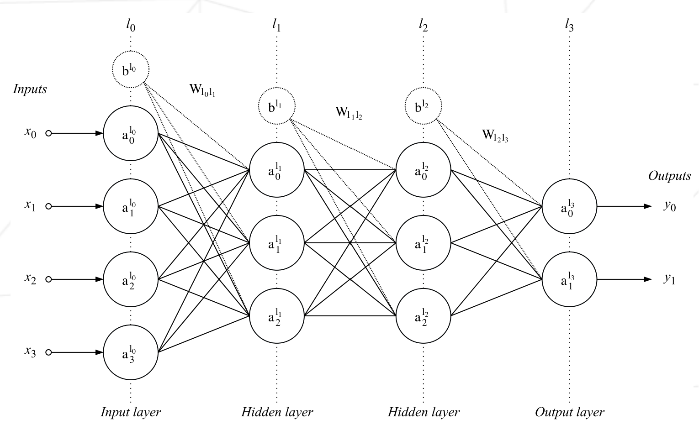

# multilayer_perceptron
The goal of this project is to build a multi-layer perceptron from scratch to create a model that predicts the outcome of a breast cancer diagnosis.

<br></br>

## Multilayer perceptron
The multilayer perceptron is a feedforward network (meaning that the data flows from the input layer to the output layer) defined by the presence of one or more hidden layers as well as an interconnection of all the neurons of one layer to the next.



The diagram above represents a network containing 4 dense layers (also called fully
connected layers). Its inputs consist of 4 neurons and its output of 2 (perfect for binary classification). The weights of one layer to the next are represented by two dimensional matrices noted $W_{l_jl_{j+1}}$ . The matrix $W_{l_0l_1}$
is of size (3, 4) for example, as it contains the weights of the connections between the layer $l_0$ and the layer $l_1$.
The bias is often represented as a special neuron which has no inputs and with an
output always equal to 1. Like a perceptron it is connected to all the neurons of the following layer (the bias neurons are noted $b^{l_j}$ on the diagram above). The bias is generally useful as it allows to “control the behavior” of a layer.

<br></br>

## Perceptron
The perceptron is the type of neuron that the multilayer perceptron is composed
of. They are defined by the presence of one or more input connections, an activation function and a single output. Each connection contains a weight (also called parameter) which is learned during the training phase.


Two steps are necessary to get the output of a neuron. The first one consists in computing the weighted sum of the outputs of the previous layer with the weights of the input connections of the neuron, which gives

$$
weightedSum=\sum_{k=0}^{N-1}(x_k·w_k)+bias
$$

The second step consists in applying an activation function on this weighted sum, the output of this function being the output of the perceptron, and can be understood as the threshold above which the neuron is activated.

<br></br>

## Dataset attribute information

### 1. ID number
### 2. Diagnosis (M = malignant, B = benign)
### 3-32. Ten real-valued features are computed for each cell nucleus:

	a) radius (mean of distances from center to points on the perimeter)
	b) texture (standard deviation of gray-scale values)
	c) perimeter
	d) area
	e) smoothness (local variation in radius lengths)
	f) compactness (perimeter^2 / area - 1.0)
	g) concavity (severity of concave portions of the contour)
	h) concave points (number of concave portions of the contour)
	i) symmetry
	j) fractal dimension ("coastline approximation" - 1)

The mean, standard error, and "worst" or largest (mean of the three
largest values) of these features were computed for each image,
resulting in 30 features.  For instance, field 3 is Mean Radius, field
13 is Radius SE, field 23 is Worst Radius.

The following commands can be used to obtain statistical information about the data.

```bash
python describe.py dataset/wdbc.csv
```


